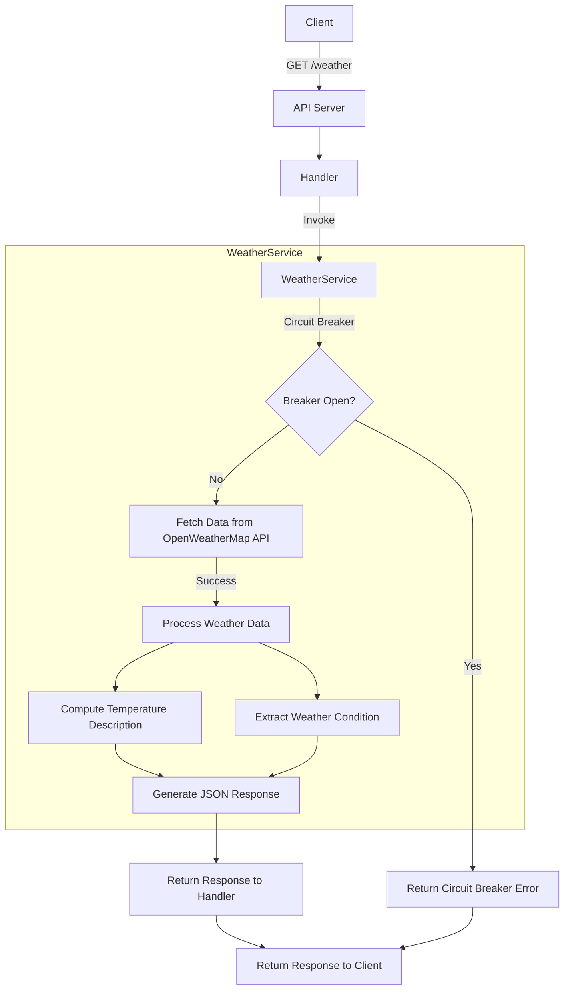

# weather-service-go

This Weather service project hosts an http server that uses the Open Weather API that exposes an endpoint that takes in lat/long coordinates and return what the weather condition is outside in that area (snow, rain, etc), whether it’s hot, cold, or moderate outside.

## Project Structure

```
/weather-service-go
├── cmd                     # Source code for application's executables
│   └── api                 # API server directory
│       ├── main.go         # Main file for the API server
├── e2e                     # End-to-end tests directory
│   └── app_test.go         # API server end-to-end tests
├── internal
│   ├── api                 # API specific code, OpenAPI specifications
│   │   ├── server.go       # Generated server initialization and routing
│   │   ├── types.go        # Generated types and models from the OpenAPI specification
│   │   └── handler         # Handlers implementing the server logic
│   │       ├── handler.go  # Handlers for each API endpoint
│   ├── service             # Business logic layer
│   ├── entity              # Domain entities. In this case, the Weather entity from the Open Weather API
├── spec                    # OpenAPI Specifications for the project
├── tools                   # Tools and utilities
├── Makefile                # Makefile for common tasks
├── go.mod                  # Go module file
├── go.sum                  # Go sum file
└── README.md               # Project README
```

## Getting Started

### Prerequisites

- Go 1.16 or later
- Make
- Set up an account on [Open Weather API](https://openweathermap.org/api) and get an API key for Current Weather Data API
- Update the `.env` file with the Open Weather API key `WEATHER_SERVICE_API_KEY`

### Running the application

1. Clone the repository

```bash
git clone
```

2. Change into the project directory

```bash
cd weather-service-go
```

3. Run the application

```bash
make run-api
```

The API server will start on port 8080.

4. To Run tests

```bash
make test
```

### OpenAPI Specifications

- The server code is generated from the OpenAPI specifications using `oapi-codegen`.
- The OpenAPI specifications for the project can be found in the `spec` directory.
- To generate the server code, run the following command:

```bash
make generate-api
```
- Any changes to the OpenAPI specifications should be followed by running the above command to generate the server code and implement the changes.

### Features

- [x] Get weather by lat/long

### API Endpoints

- `GET /weather?lat={latitude}&long={longitude}&units={units}` - Get weather by lat/long and units (metric, imperial)

**Temperature Description**

Use the main.temp from the Open Weather API response to determine the temperature description and apply the following rules:
- Cold: temp < 283.15 (10°C)
- Moderate: 283.15 ≤ temp < 293.15 (10°C to 20°C)
- Warm: 293.15 ≤ temp < 303.15 (20°C to 30°C)
- Hot: temp ≥ 303.15 (30°C)

**Weather Condition**

Use the weather.main field as is from the Open Weather API response. No transformation is needed.

**Response format:**

```json
{
  "temperatureCondition": "Cold",
  "temperature": 113,
  "weatherCondition": "Rain",
  "units": "metric"
}
```

## High-Level Design


